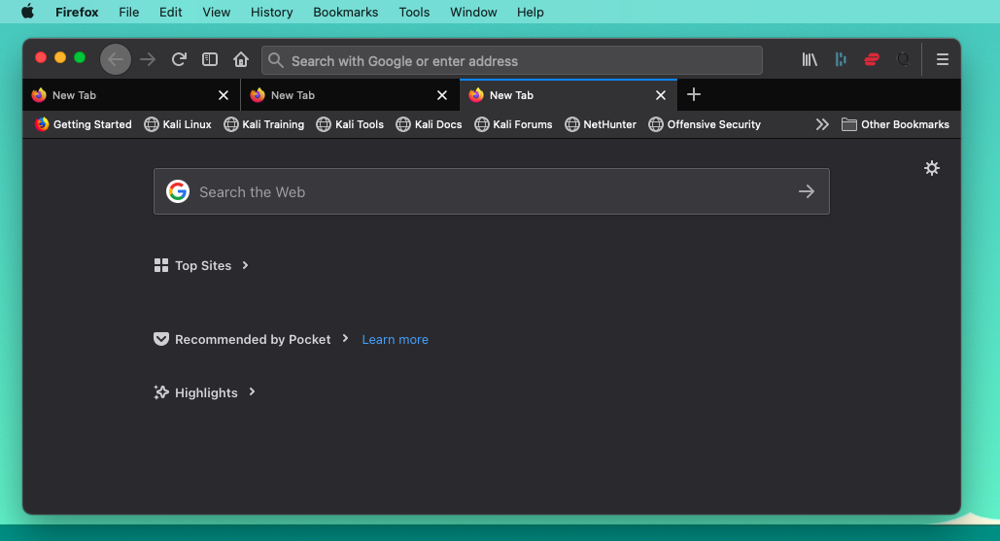

# Firefox-userChrome-extensions
A collection of userChrome.css styles for Firefox.

[Tabs On Bottom](images/tabs-on-bottom.png)
---
Moves tabs to the bottom.

## How to install

1. Go to `about:support` in Firefox and open your Profile Folder.

   On Mac, Windows, profile folder location generally looks like this:

   Mac: ~/Library/Application Support/Firefox/Profiles/<your_profile_dir>

   Windows: C:\Users\<your_user>\AppData\Roaming\Mozilla\Firefox\Profiles\<your_profile_dir> 

2. Drop files into "chrome" folder, if not present create it.
3. Go to `about:config` in Firefox and set value of `toolkit.legacyUserProfileCustomizations.stylesheets` to `true`.
   (this enables the loading of user chrome mods)
4. Restart Firefox for the new styles to take affect.
